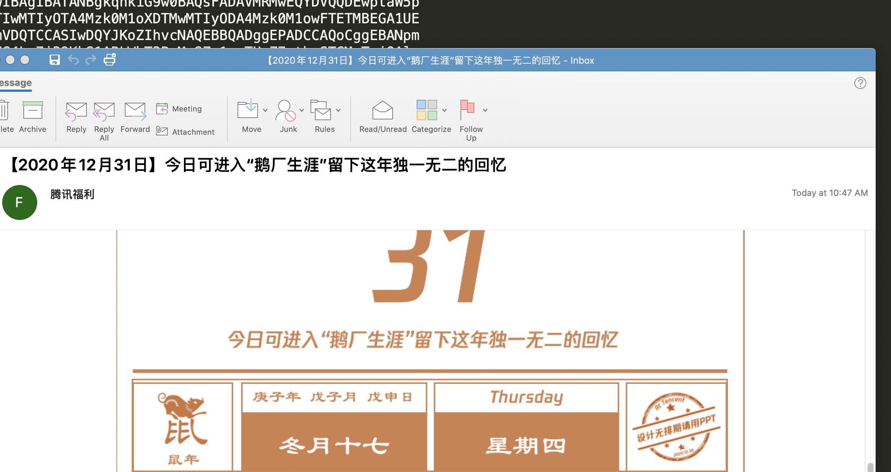

# Aeraki

[](https://github.com/aeraki-framework/aeraki/actions?query=branch%3Amaster+event%3Apush+workflow%3A%22ci%22)
[](https://github.com/aeraki-framework/aeraki/actions?query=branch%3Amaster+event%3Apush+workflow%3A%22e2e-dubbo%22)
[](https://github.com/aeraki-framework/aeraki/actions?query=branch%3Amaster+event%3Apush+workflow%3A%22e2e-thrift%22)
[](https://github.com/aeraki-framework/aeraki/actions?query=branch%3Amaster+event%3Apush+workflow%3A%22e2e-kafka-zookeeper%22)
[](https://github.com/aeraki-framework/aeraki/actions?query=branch%3Amaster+event%3Apush+workflow%3A%22e2e-redis%22)

# Manage **any** layer 7 traffic in Istio service mesh!

---
Aeraki [Air-rah-ki] is the Greek word for 'breeze'. While Istio connects microservices in a service mesh, Aeraki provides a framework to allow Istio to support more layer 7 protocols other than just HTTP and gRPC. We hope that this breeze can help Istio sail a little further.

In a nutshell, you can think of Aeraki as the [Operator pattern](https://kubernetes.io/docs/concepts/extend-kubernetes/operator/) in Istio to automate the envoy configuration for layer 7 protocols.

IstioCon2021 Talk: [How to Manage Any Layer-7 Traffic in an Istio Service Mesh?](https://www.youtube.com/watch?v=sBS4utF68d8)

## Architecture


## Problems to solve

We are facing some challenges in Istio traffic management:
* Istio has very limited built-in support for layer 7 protocols other than HTTP and gRPC.
* It's not feasible to add all these protocols directly into Istio codebase, because it will easily blow up the repository.
* Although you could change Pilot code to support other protocols, maintanence of an Istio fork is inevitable, which makes further upgrading process painful.
* EnvoyFilter could be a possible solution, but it can be very difficult to manually create and maintain those EnvoyFilters, especially in a large service mesh - too many trivial details and moving parts!

To address these problems, Aeraki works alongside Istio, providing an non-intrusive, extendable way to manage any layer 7 traffic in a service mesh.

Aeraki is a standalone component in the service mesh control plane. It follows a non-intrusive design and leverages Istio's [EnvoyFilter API](https://istio.io/latest/docs/reference/config/networking/envoy-filter/) to push the configurations to the Envoy sidecar proxies.

Aeraki is a control plane framework for layer 7 protocol traffic management. We plan to support most of the widely used protocols such as [Dubbo](http://dubbo.apache.org/), [Thrift](https://thrift.apache.org/), [TARS](https://tarscloud.org/), [Redis](https://redis.io/topics/cluster-tutorial), [MySql](https://www.mysql.com/), etc. If you're using a proprietary protocol, you can also write your own Aeraki plugin to support it in a service mesh.

Note:
Although Aeraki is a standalone component, it does depend on Istio [xds-mcp API](https://github.com/istio/api/tree/master/mcp) and the configuration format generated by Pilot.

## Protocol selection
Similar to Istio, protocols are identified by service port prefix. Please name service ports with this pattern: `tcp-protocol-xxxx`. For example, a dubbo service port may be named as `tcp-dubbo-service`. Please keep `tcp` at the beginning of the port name because it is a TCP service from the perspective of Istio.

## Reference

* [Dubbo (中文) ](https://github.com/aeraki-framework/dubbo2istio#readme)
* [Redis (中文) ](docs/zh/redis.md)
* [LazyXDS（xDS 按需加载）](lazyxds/README.md)

## Supported protocols:
* Dubbo
  * Service Discovery
    * [x] ServiceEntry Integration ([Example](https://github.com/aeraki-framework/aeraki/blob/master/demo/dubbo/serviceentry.yaml))
    * [x] [ZooKeeper Integration](https://github.com/aeraki-framework/dubbo2istio)
    * [x] [Nacos Integration](https://github.com/aeraki-framework/dubbo2istio)
  * Traffic Management
    * [x] Request Level Load Balancing
    * [x] Version Based Routing
    * [x] Traffic Splitting
    * [x] Method Based Routing
    * [x] Header Based Routing
    * [x] Crcuit Breaker
    * [x] Locality Load Balancing
  * Observability
    * [x] Dubbo Request Metrics
  * Security 
    * [x] Peer Authorization on Interface/Method
    * [ ] Rquest Authorization
* Thrift
  * Traffic Management
    * [x] Request Level Load Balancing
    * [x] Version Based Routing
    * [x] Traffic Splitting
    * [ ] Header Based Routing
    * [ ] Rate Limit
  * Observability
    * [x] Thrift Request Metrics
* Kafka
  * [x] Metrics
* ZooKeeper
  * [x] Metrics
* Redis
  * [x] Redis Cluster
  * [x] Sharding
  * [x] Prefix Routing
  * [x] Auth
  * [x] Traffic Mirroring
* [ ] MySql
* [ ] MongoDB
* [ ] Postgres
* [ ] RocketMQ
* [ ] TARS
* ...

## Demo

[Live Demo: kiali Dashboard](http://aeraki.zhaohuabing.com:20001/)

[Live Demo: Service Metrics: Grafana](http://aeraki.zhaohuabing.com:3000/d/pgz7wp-Gz/aeraki-demo?orgId=1&refresh=10s&kiosk)

[Live Demo: Service Metrics: Prometheus](http://aeraki.zhaohuabing.com:9090/new/graph?g0.expr=envoy_dubbo_inbound_20880___response_success&g0.tab=0&g0.stacked=1&g0.range_input=1h&g1.expr=envoy_dubbo_outbound_20880__org_apache_dubbo_samples_basic_api_demoservice_request&g1.tab=0&g1.stacked=1&g1.range_input=1h&g2.expr=envoy_thrift_inbound_9090___response&g2.tab=0&g2.stacked=1&g2.range_input=1h&g3.expr=envoy_thrift_outbound_9090__thrift_sample_server_thrift_svc_cluster_local_response_success&g3.tab=0&g3.stacked=1&g3.range_input=1h&g4.expr=envoy_thrift_outbound_9090__thrift_sample_server_thrift_svc_cluster_local_request&g4.tab=0&g4.stacked=1&g4.range_input=1h)

Screenshot: Service Metrics:


Recored Demo: Dubbo and Thrift Traffic Management
[](https://www.youtube.com/watch?v=vrjp-Yg3Leg)

## Install

### Pre-requirements:
* A running Kubernetes cluster, which can be either a cluster in the cloud, or a local cluster created with kind/minikube
* Kubectl installed, and the `~/.kube/conf` points to the cluster in the first step
* Helm installed, which will be used to install some components in the demo

### Download Aeraki from the Github
```bash
git clone https://github.com/aeraki-framework/aeraki.git
```

### Install Aeraki and demo applications
```bash
aeraki/demo/install-demo.sh
```

### Open the following URLs in your browser to play with Aeraki and view service metrics
* Kaili `http://{istio-ingressgateway_external_ip}:20001`
* Grafana `http://{istio-ingressgateway_external_ip}:3000`
* Prometheus `http://{istio-ingressgateway_external_ip}:9090`

You can import Aeraika demo dashboard from file `demo/aeraki-demo.json` into the Grafana.

## Contact
* Mail: If you're interested in contributing to this project, please reach out to zhaohuabing@gmail.com
* Wechat Group: Please contact Wechat ID: zhao_huabing to join the Aeraki Wechat group
* Slack: Join [Aeraki slack channel](http://aeraki.slack.com/)
