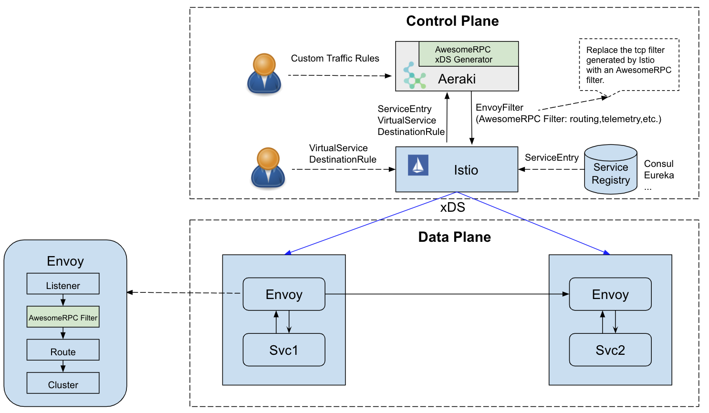

<!--
# Copyright Aeraki Authors
#
# Licensed under the Apache License, Version 2.0 (the "License");
# you may not use this file except in compliance with the License.
# You may obtain a copy of the License at
#
#     http://www.apache.org/licenses/LICENSE-2.0
#
# Unless required by applicable law or agreed to in writing, software
# distributed under the License is distributed on an "AS IS" BASIS,
# WITHOUT WARRANTIES OR CONDITIONS OF ANY KIND, either express or implied.
# See the License for the specific language governing permissions and
# limitations under the License.
-->

# Aeraki （[English](./README.md)）

[](https://github.com/aeraki-mesh/aeraki/blob/master/LICENSE)
[](https://goreportcard.com/report/github.com/aeraki-mesh/aeraki)
[](https://github.com/aeraki-mesh/aeraki/actions?query=branch%3Amaster+event%3Apush+workflow%3A%22ci%22)
[](https://github.com/aeraki-mesh/aeraki/actions?query=branch%3Amaster+event%3Apush+workflow%3A%22e2e-metaprotocol%22)
[](https://github.com/aeraki-mesh/aeraki/actions?query=branch%3Amaster+event%3Apush+workflow%3A%22e2e-dubbo%22)
[](https://github.com/aeraki-mesh/aeraki/actions?query=branch%3Amaster+event%3Apush+workflow%3A%22e2e-thrift%22)
[](https://github.com/aeraki-mesh/aeraki/actions?query=branch%3Amaster+event%3Apush+workflow%3A%22e2e-kafka-zookeeper%22)
[](https://github.com/aeraki-mesh/aeraki/actions?query=branch%3Amaster+event%3Apush+workflow%3A%22e2e-redis%22)

<a href="https://www.aeraki.net/zh/">
    
</a>

# 在服务网格中管理任何七层流量!

**Aeraki** [Air-rah-ki] 是希腊语 ”微风“ 的意思。 虽然服务网格已经成为微服务的重要基础设施，但许多（也许是全部？）服务网格的实现主要关注 HTTP 协议，而将其他七层协议视为普通的 TCP 流量。Aeraki Mesh 提供了一种非侵入的、高度可扩展的解决方案来管理服务网格中的任何7层流量。

请注意：Aeraki 只处理服务网格的非 HTTP 七层流量，而将 HTTP 流量留给其他现有的服务网格项目。(现有的项目已经足够优秀，而不必重新造轮子)。  Aeraki 目前可以与 Istio 集成，不排除在未来可能会支持其他服务网格项目。

## 待解决的问题

我们在服务网格中面临的一些挑战：
* Istio 和其他流行的服务网格实现对 HTTP 和 gRPC 协议之外的7层协议的支持非常有限。
* Envoy RDS (Route Discovery Service) 是专为 HTTP 设计的。而其他的协议，如 Dubbo 和 Thrift 等，只能使用监听器内联路由来进行流量管理，当路由改变时，需要重建监听器，导致存量链接上的请求被中断而出现错误。
* 在服务网格中引入一个专有协议需要花费很多精力。需要编写一个 Envoy 过滤器来处理网络层的流量，以及一个专有控制面来管理这些 Envoy 代理。

这些问题使得用户难以在服务网格中管理微服务中其他广泛使用的7层协议的流量。例如，在一个微服务应用中，我们可能使用以下协议。

* RPC: HTTP, gRPC, Thrift, Dubbo, 私有 RPC 协议 …
* 消息队列: Kafka, RabbitMQ …
* 缓存: Redis, Memcached …
* 数据库: MySQL, PostgreSQL, MongoDB …


如果你已经在服务网格中投入了大量的精力，你当然希望能够在服务网格中管理所有这些协议的流量。

## Aeraki 的解决方案

为了解决这些问题，Aeraki Mesh 提供了一种非侵入性的、高度可扩展的方式来管理任何服务网中的7层流量。


正如该图所示，Aeraki Mesh 由以下几部分组成。

* Aeraki: [Aeraki](https://github.com/aeraki-mesh/aeraki) 为运维提供了高层次的、用户友好的流量管理规则，将规则转化为 envoy 代理配置，并利用 Istio 的`EnvoyFilter` API 将配置推送给数据面的 sidecar 代理。 Aeraki 还在控制面中充当了 MetaProtocol Proxy 的 RDS（路由发现服务）服务器。不同于专注于 HTTP 的 Envoy RDS，Aeraki RDS 旨在为所有七层协议提供通用的动态路由能力。
* MetaProtocol Proxy: [MetaProtocol Proxy](https://github.com/aeraki-mesh/meta-protocol-proxy) 是一个七层代理框架，为七层协议提供了常用的流量管理能力，如负载均衡、熔断、路由、本地/全局限流、故障注入、指标收集、调用跟踪等等。我们可以基于 MetaProtocol Proxy 提供的通用能力创建自己专有协议的七层代理。要在服务网格中加入一个新的协议，唯一需要做的就是实现 [编解码器接口](https://github.com/aeraki-mesh/meta-protocol-proxy/blob/ac788327239bd794e745ce18b382da858ddf3355/src/meta_protocol_proxy/codec/codec.h#L118) （通常只需数百行代码）和几行 yaml 配置。如果有特殊的要求，而内置的功能又不能满足，MetaProtocol Proxy 还提供了一个扩展机制，允许用户编写自己的七层过滤器，将自定义的逻辑加入 MetaProtocol Proxy 中。

MetaProtocol Proxy 中已经支持了 [Dubbo](https://github.com/aeraki-mesh/meta-protocol-proxy/tree/master/src/application_protocols/dubbo)，
[Thrift](https://github.com/aeraki-mesh/meta-protocol-proxy/tree/master/src/application_protocols/thrift) 
，[bRPC](https://github.com/aeraki-mesh/meta-protocol-proxy/tree/master/src/application_protocols/brpc)
和[一系列私有协议](https://github.com/aeraki-mesh/aeraki/issues/105)。如果你正在使用一个闭源的专有协议，也可以在服务网格中管理它，只需为它编写一个 MetaProtocol 编解码器即可。

大多数请求/响应式的无状态协议和流式调用都可以建立在 MetaProtocol Proxy 之上。但是，由于有些协议的路由策略过于 "特殊"，无法在 MetaProtocol 中规范化。例如，Redis 代理使用 slot number 将客户端查询映射到特定的Redis服务器节点，slot number 是由请求中的密钥计算出来的。只要在 Envoy Proxy 中有一个可用的 TCP filter，Aeraki 仍然可以管理这些协议。目前，对于这一类的协议，Aeraki 支持 [Redis](https://github.com/aeraki-mesh/aeraki/blob/master/docs/zh/redis.md) 和 Kafka。
## 支持的协议:
Aeraki 已经支持下述协议：
* Dubbo (Envoy 原生过滤器）
* Thrift (Envoy 原生过滤器)
* Kafka (Envoy 原生过滤器)
* Redis (Envoy 原生过滤器)
* MetaProtocol-Dubbo
* MetaProtocol-Thfirt
* MetaProtocol-bRPC（百度开源 RPC 协议）
* MetaProtocol-tRPC（腾讯内部 RPC 协议）
* MetaProtocol-qza（腾讯音乐内部协议）
* MetaProtocol-videoPacket（腾讯融媒体内部协议）
* MetaProtocol-其他协议：灵雀云、腾讯游戏人生等的内部协议...
* MetaProtocol-私有协议：需要在服务网格中接入你的私有协议？没有问题，几乎任何七层协议都可以基于 [MetaProtocol](https://github.com/aeraki-mesh/meta-protocol-proxy) 实现，并在 Aeraki Mesh 中进行流量管理

## 支持的特性:
  * 流量管理
    * [x] 请求级负载均衡/地域感知负载均衡（支持一致哈希算法/会话保持）
    * [x] 熔断
    * [x] 灵活的路由匹配条件（任何从7层数据包中提取的属性，都可作为匹配条件）
    * [x] 通过 Aeraki MetaRDS 实现动态路由更新
    * [x] 基于版本的路由
    * [x] 流量分流
    * [x] 本地流量限制
    * [x] 全局流量限制
    * [x] 消息修改
    * [x] 流量镜像
  * 可观测性
    * [x] 请求级指标 (请求级延迟、计数、错误等)
    * [ ] 分布式追踪
  * 安全性
    * [x] 基于接口/方法的对等授权
    * [ ] 授权请求

> 请注意: 建立在 MetaProtocol 之上的协议实现支持 Aeraki Mesh 的上述所有功能，Envoy 原生 filter 只支持部分上述功能，这取决于原生 filter 的能力。

## 样例

https://www.aeraki.net/docs/v1.x/quickstart/

## 安装

https://www.aeraki.net/docs/v1.x/install/

## 构建

### 依赖
* Golang Version >= 1.16, and related golang tools installed like `goimports`, `gofmt`, etc.
* Docker and Docker-Compose installed

### 构建 Aeraki 二进制文件

```bash
# build aeraki binary on linux
make build

# build aeraki binary on darwin
make build-mac
```

### 构建 Aeraki Docker 镜像

```bash
# build aeraki docker image with the default latest tag
make docker-build

# build aeraki docker image with xxx tag
make docker-build tag=xxx

# build aeraki e2e docker image
make docker-build-e2e
```

## 贡献代码

如果您有兴趣向 Aeraki 项目贡献代码，请先阅读 [Contributing to Aeraki](CONTRIBUTING.md).

## 外部分享

* IstioCon 2022：[Tencent Music’s service mesh practice with Istio and Aeraki(Istio + Aeraki 在腾讯音乐的服务网格落地)](https://events.istio.io/istiocon-2022/sessions/tencent-music-aeraki/)
* Istio meetup China(中文)：[全栈服务网格 - Aeraki 助你在 Istio 服务网格中管理任何七层流量](https://www.youtube.com/watch?v=Bq5T3OR3iTM) 
* IstioCon 2021：[How to Manage Any Layer-7 Traffic in an Istio Service Mesh?](https://www.youtube.com/watch?v=sBS4utF68d8)

## 谁在使用 Aeraki?

真诚地感谢大家选择、贡献和使用 Aeraki。我们创建了这个 issue 来收集 Aeraki 的使用案例，以便我们能够推动 Aeraki 社区向正确的方向发展，以更好地服务于真实的使用场景。我们鼓励您在这个问题上提交评论，包括您的使用方式：https://github.com/aeraki-mesh/aeraki/issues/105

## 联系我们
* Wechat Group: 请联系微信ID：zhao_huabing，来加入 Aeraki 微信群聊
* Slack Channel: 加入 [我们的 Slack 频道](https://cloud-native.slack.com/messages/aeraki-mesh)
* 社区会议: [会议日程和录像](https://www.aeraki.net/community/#community-meetings)

## 开源许可证

本项目使用[Apache 2.0 License](LICENSE)

## 行为准则
我们的遵循 CNCF 行为准则[CNCF Code of Conduct](CODE_OF_CONDUCT.md)

## CNCF 云原生全景图

<p align="center">
&nbsp;&nbsp;
<br/><br/>
Aeraki Mesh 是一个<a href="https://landscape.cncf.io/?selected=aeraki-mesh"> CNCF 沙箱项目</a>
</p>
