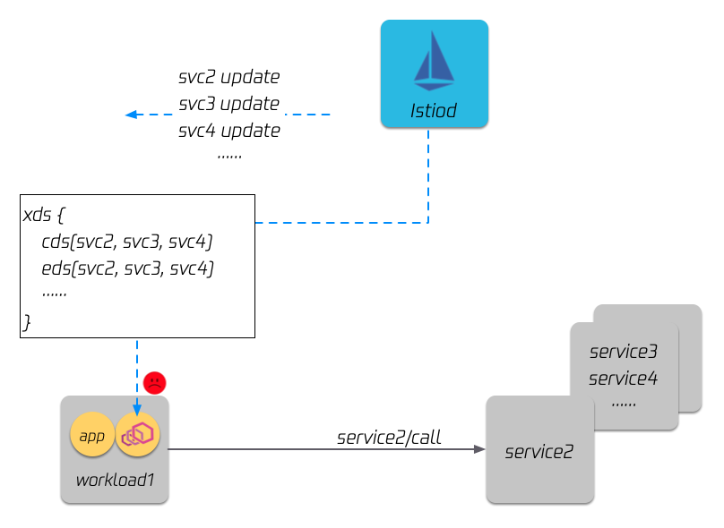
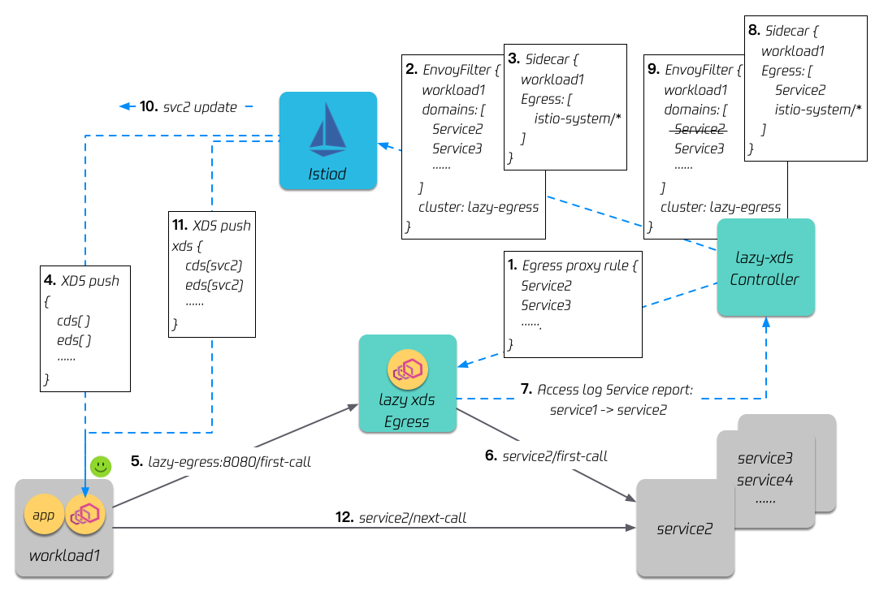
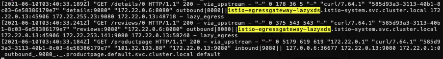
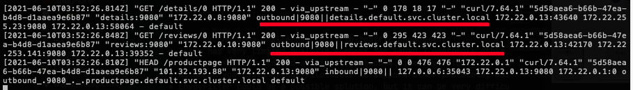
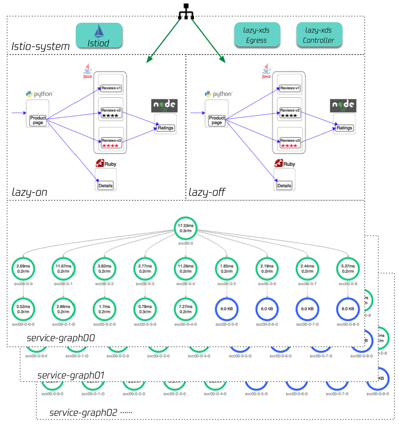
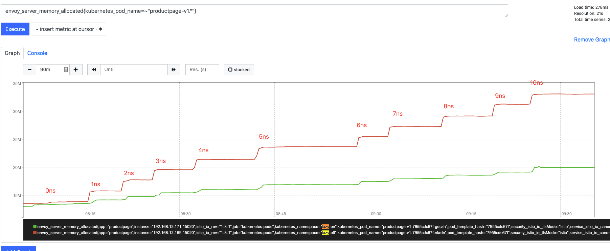
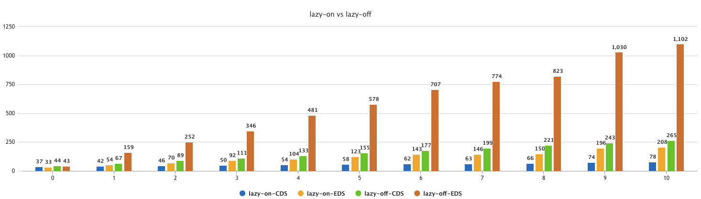

# LazyXds

LazyXds enables Istio only push needed xds to sidecars to reduce resource consumption and speed up xds configuration propagation.

## Problems to solve



## Architecture



## Install

### Pre-requirements:

* A running Kubernetes cluster, and istio(version >= 1.10.0) installed
* Kubectl installed, and the `~/.kube/conf` points to the cluster in the first step

### Install Lazyxds egress and controller

```
kubectl apply -f https://raw.githubusercontent.com/aeraki-framework/aeraki/master/lazyxds/install/lazyxds-egress.yaml
kubectl apply -f https://raw.githubusercontent.com/aeraki-framework/aeraki/master/lazyxds/install/lazyxds-controller.yaml
```

The above commands install the lazyxds egress and controller into the istio-system namespace.

## How to enable LazyXDS

You can choose to enable lazyXDS on some particular services or enable it namespace wide. To enable lazyXDS on a service or a namespace, you just need to add an annotation `lazy-xds: "true"` to the target service or namespace.

### Enable on a Service

```
apiVersion: v1
kind: Service
metadata:
  name: my-service
  annotations:
    lazy-xds: "true"
spec:
```

or use kubectl: 

`kubectl annotate service my-service lazy-xds=true --overwrite`

### Enable on a Namespace

```
apiVersion: v1
kind: Namespace
metadata:
  name: my-namespace
  annotations:
    lazy-xds: "true"
spec:
```

or use kubectl: 

`kubectl annotate namespace my-namespace lazy-xds=true --overwrite`

## Bookinfo Demo

1. Install istio(version >= 1.10.0), and enable access log for debug purpose.

    ```
    istioctl install -y --set meshConfig.accessLogFile=/dev/stdout
    ```

2. Install lazyXds by following the instructions in [Install Lazyxds egress and controller](https://github.com/aeraki-framework/aeraki/blob/master/lazyxds/README.md#install-lazyxds-egress-and-controller).

3. Install bookinfo application:

    ```
    kubectl label namespace default istio-injection=enabled
    kubectl apply -f https://raw.githubusercontent.com/istio/istio/release-1.10/samples/bookinfo/platform/kube/bookinfo.yaml
    kubectl apply -f https://raw.githubusercontent.com/istio/istio/release-1.10/samples/bookinfo/networking/bookinfo-gateway.yaml
    ```
   
    Determine the ingress IP, and we use 80 as the ingress port by default.
    ```
    export INGRESS_HOST=$(kubectl -n istio-system get service istio-ingressgateway -o jsonpath='{.status.loadBalancer.ingress[0].ip}')
    ```
   
    Save product page pod name to env for later use.
    ```
    export PRODUCT_PAGE_POD=$(kubectl get pod -l app=productpage -o jsonpath="{.items[0].metadata.name}")
    ```
   
    Check the eds of product page pod, we can see product page gets all eds of bookinfo, though it does not need all of them:
    ```
    istioctl pc endpoints $PRODUCT_PAGE_POD | grep '9080'
    172.22.0.10:9080                 HEALTHY     OK                outbound|9080||reviews.default.svc.cluster.local
    172.22.0.11:9080                 HEALTHY     OK                outbound|9080||reviews.default.svc.cluster.local
    172.22.0.12:9080                 HEALTHY     OK                outbound|9080||reviews.default.svc.cluster.local
    172.22.0.13:9080                 HEALTHY     OK                outbound|9080||productpage.default.svc.cluster.local
    172.22.0.8:9080                  HEALTHY     OK                outbound|9080||details.default.svc.cluster.local
    172.22.0.9:9080                  HEALTHY     OK                outbound|9080||ratings.default.svc.cluster.local
    ```

4. Enable lazyXds for the productpage service:

    ```
    kubectl annotate service productpage lazy-xds=true --overwrite
    ```
   
    Check the eds of product page:
    ```
    istioctl pc endpoints $PRODUCT_PAGE_POD | grep '9080'
    // no eds show
    ```
    Once enabling lazyXds, product page pod won't get any endpoints of bookinfo.

5. Access bookinfo the first time:

    ```
    curl -I "http://${INGRESS_HOST}/productpage"
    ```
   
   check the access log of product page pod:
   
   ```
   kubectl logs -c istio-proxy -f $PRODUCT_PAGE_POD
   ```
   
   
   
   We can see the first request form product page to details and reviews has been redirected to `istio-egressgateway-lazyxds`
   
   Check the eds of product page again:
   
   ```
   172.22.0.10:9080                 HEALTHY     OK                outbound|9080||reviews.default.svc.cluster.local
   172.22.0.11:9080                 HEALTHY     OK                outbound|9080||reviews.default.svc.cluster.local
   172.22.0.12:9080                 HEALTHY     OK                outbound|9080||reviews.default.svc.cluster.local
   172.22.0.8:9080                  HEALTHY     OK                outbound|9080||details.default.svc.cluster.local
   ```
   
   Only reviews and details endpoints are in the eds, which are the exact endpoints product page needs.

6. Access bookinfo again:

   ```
   curl -I "http://${INGRESS_HOST}/productpage"
   ```
    
   Check the access log of product page pod:
   
   ```
   kubectl logs -c istio-proxy -f $PRODUCT_PAGE_POD
   ```

   
   
   Now the traffic goes directly to the target services since the sidecar proxy already has all the endpoints it needs.
 
## Uninstall

```
kubectl delete -f https://raw.githubusercontent.com/aeraki-framework/aeraki/master/lazyxds/install/lazyxds-controller.yaml
kubectl delete -f https://raw.githubusercontent.com/aeraki-framework/aeraki/master/lazyxds/install/lazyxds-egress.yaml
```

## Performance

We have set up two bookinfo applications in an istio mesh with lazyxds installed, the product page in `lazy-on` namespace has lazyXds enabled, and the other one hasn't.
Then we use [istio load testing](https://github.com/istio/tools/tree/master/perf/load) to increasingly create a large number of services, 
each load test namespace contains 19 services, each service contains 5 pods. The following is the test result for your reference:


   
Memory compare:
   


EDS and CDS compare:


